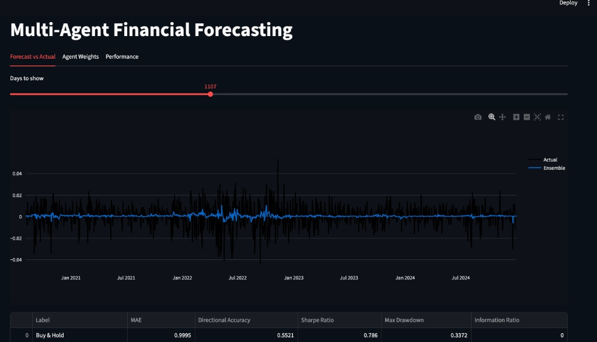

#  Multi-Agent Financial Forecasting & Game-Theoretic Referee

[](https://multi-agent-forecasting-vfjklg36dptbikplrehhha.streamlit.app/)


##  One-Line Pitch

An algorithmic trading framework combining specialized machine learning agents via Hedge ensembling to forecast daily SPY returns.

---

##  Live Interactive Dashboard

Explore live forecasts, interactive backtests, and agent weight evolution:  
👉 **[Launch Live Streamlit Dashboard](https://multi-agent-forecasting-vfjklg36dptbikplrehhha.streamlit.app/)**

---

##  Architecture & Pipeline

This project employs a multi-agent framework where specialized quantitative models generate independent daily log-return predictions. The individual forecasts are dynamically weighted using a game-theoretic **Hedge Aggregator**, fed into a walk-forward backtest, and visualized in real time.

```text
┌─────────────────┐
│   TrendAgent    │──────┐
└─────────────────┘      │
┌─────────────────┐      │
│  MomentumAgent  │──────┤     ┌──────────────────┐     ┌──────────────────────┐     ┌────────────────────┐
└─────────────────┘      ├────►│ Hedge Aggregator │────►│ Walk-Forward Backtest│────►│ Streamlit Dashboard│
┌─────────────────┐      │     └──────────────────┘     └──────────────────────┘     └────────────────────┘
│ VolatilityAgent │──────┤
└─────────────────┘      │
┌─────────────────┐      │
│  SequenceAgent  │──────┘
└─────────────────┘
```
---
##  Agent Breakdown

* **TrendAgent**: Linear regression incorporating deterministic calendar seasonality.
* **MomentumAgent**: Gradient Boosted Trees (XGBoost) trained on lag returns and momentum technical indicators (RSI, MACD).
* **VolatilityAgent**: XGBoost model focused exclusively on market volatility metrics (Bollinger Band width, VIX levels/changes).
* **SequenceAgent**: PyTorch-based LSTM capturing multi-day sequential patterns and deep temporal structures in return series.
* **Hedge Aggregator**: Dynamically updates model weights daily using exponentially weighted loss update rules (MSE or Directional Loss) governed by an exponential learning rate parameter ($\eta$) and a uniform allocation floor ($\alpha$).

---

## Results & Performance Benchmark

Evaluating out-of-sample performance over walk-forward testing:

| Model / Strategy | Sharpe Ratio | Directional Accuracy |
| :--- | :---: | :---: |
| **Buy & Hold** | **0.76** | **0.55** |
| **TrendAgent** | 0.44 | 0.52 |
| **VolatilityAgent** | 0.27 | 0.52 |
| **Hedge Ensemble** | **0.21** | **0.51** |
| **Equal Weight** | 0.03 | 0.50 |
| **MomentumAgent** | -0.02 | 0.50 |
